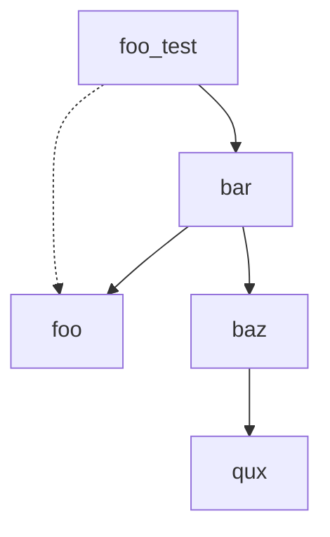

# rules_go x_defs issue reproducing

## Dependencies

```mermaid
graph TD
    foo
    foo_test
    bar
    baz
    qux

    foo_test --> bar
    foo_test -.-> foo
    bar --> baz
    bar --> foo
    baz --> qux
```

With this dependency graph we lost `x_defs` declaration on `qux` package.
